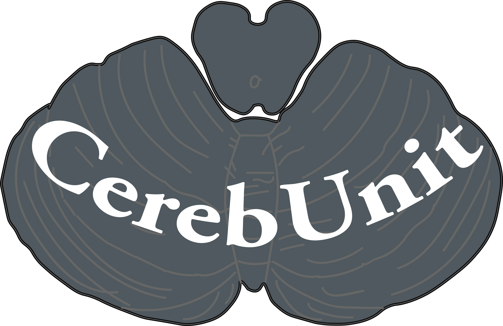

<!--  -->

# cerebellum-unit
Package for running validation test on cerebellum models.

## Description
This repository is at the develomental stage.

## ~~Table of Contents~~

## Installation
Dependant packages (versions based on 31 AUgust 2017):
- [SciUnit](https://github.com/scidash/sciunit)
- [NEURON](https://www.neuron.yale.edu/neuron/download) (tested on Release 7.4 (1370:16a7055d4a86) 2015-11-09)

## Usage

## ~~Contribution~~

## ~~Credits~~

## License
BSD-3-Clause
Copyright 2017 Lungsi
see LICENSE.txt
